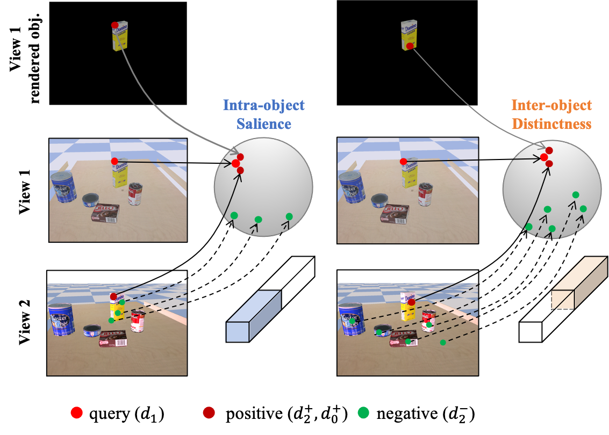

# Sim2Real Object-Centric Keypoint Detection and Description
[Project](https://zhongcl-thu.github.io/rock/) | [Poster](https://zhongcl-thu.github.io/projects/AAAI22/aaai_poster.pdf) 

This repository contains the implementation of the following [paper](https://arxiv.org/abs/2202.00448):

Sim2Real Object-Centric Keypoint Detection and Description  
[Chengliang Zhong](https://zhongcl-thu.github.io/), [Chao Yang](https://scholar.google.com/citations?user=5KRbHPMAAAAJ&hl=zh-CN), Jinshan Qi, [Fuchun Sun](https://scholar.google.com/citations?user=DbviELoAAAAJ&hl=zh-CN), [Huaping Liu](https://sites.google.com/site/thuliuhuaping), Xiaodong Mu, [Wenbing Huang](https://scholar.google.com/citations?user=0yNkmO4AAAAJ&hl=zh-CN)

In AAAI 2022

<p align="center"></p>


If you find our code or paper useful, please consider citing:
```bibtex
@article{zhong2022sim2real,
  title={Sim2Real Object-Centric Keypoint Detection and Description},
  author={Zhong, Chengliang and Yang, Chao and Qi, Jinshan and Sun, Fuchun and Liu, Huaping and Mu, Xiaodong and Huang, Wenbing},
  journal={arXiv preprint arXiv:2202.00448},
  year={2022}
}
```

This repository is a PyTorch implementation.

**Note**: Our new work on unsupervised 3D keypoint detection can be seen via this [link](https://github.com/zhongcl-thu/SNAKE).

## Datasets
Training dataset:
To align the synthetic and real domains, we refer to the idea of physically plausible domain randomization (PPDR) to generate the scenes where objects can be fallen onto the table/ground with preserving physical properties, which is followed by [DSR](https://github.com/columbia-ai-robotics/dsr) and [YCBInEOAT](https://github.com/wenbowen123/iros20-6d-pose-tracking).
The synthetic training dataset that consists of 21 YCB-VIDEO objects is generated via the Pybullet simulator. The training dataset is not publicly available at this time.

Test datasets consist of: 
- YCB-VIDEO dataset. The link to download real images is [here](https://rse-lab.cs.washington.edu/projects/posecnn/), and the rendered images of each object (templates) and object CAD models can be downloaded from [link1](https://drive.google.com/file/d/1cvLhq8ygjYoaP2YWWI_ibUKaszZzEMIp/view?usp=sharing) and [link2](https://drive.google.com/file/d/1AJbO9g9KXRfMpX9OKwtdyy2VKgFQRbiN/view?usp=sharing).
- YCBInEOAT dataset. Download the [keyframes](https://drive.google.com/file/d/16E-zhffvKQCEqCvujvHREMxYuiEfMwdF/view?usp=sharing) we use in the test. The full dataset can be downloaded via this [link](https://github.com/wenbowen123/iros20-6d-pose-tracking).

**Note**: Please move the YCB-VIDEO dataset into the 'data' folder, and change the folder name to 'ycb_real'. The pre-processed data that we upload to google drive are also moved into the 'data' folder, then unzipped.

Our 'data' folder structure is as follows:

```
data
  ├── ycb_real
  │    ├── 0000
  │    ├── 0001
  │    ├── ....
  │    ├── 0091
  ├── ycb_template
  ├── ycb_model
  └── YCBInEOAT
```


## Installation
Make sure that you have all dependencies in place. The simplest way to do so, is to use anaconda.

You can create an anaconda environment called **rock** using
```
conda create --name rock python=3.7
conda activate rock
```

Install python packages, run :
```
pip install -r requirements.txt 
```


## Training

TBD.


## Evaluate
### 1. Sim-Real Match

Test on YCB-VIDEO dataset. Two adjacent frames are selected where the next frame is adopted as a target (real) image, and the rendered (synthetic) images on the previous pose of each object are used as the references. Pairs are matched and filtered by RANSAC. Run:
```
bash exp/ours/test.sh --sim2real_match
```

### 2. Real-Real Match

Test on YCBInEOAT dataset. The keypoints and descriptors from the manipulated object whose mask is known in the initial frame of each video, predicted by keypoint methods, are matched with the subsequent frames (targets) to show the tracking performance on the object keypoints. Run:
```
bash exp/ours/test.sh --match_tracking
```

### 3. Sim2real Pose Estimation

Test on YCB-VIDEO dataset. The pipeline of pose estimation: (1) Render multiple images in different poses of the test objects as templates. To balance the evaluation speed and accuracy, we rendered 96 templates for each object. (2) Match the templates with the real images one by one, and select the best template according to the number of matched pairs. (3) 6D pose can be solved through the Perspective-n-Point (PnP) and RANSAC algorithms. Run:
```
bash exp/ours/test.sh --sim2real_6dpose
```


## Pretrained models

We provide pretrained models on [Google Drive](https://drive.google.com/drive/folders/1t1TDdp3RqPGZoZ-4uzjwKSJolFQ7FzPt?usp=sharing). Move the models into *exp/ours/*. 


## License

This repository is released under the MIT License.


## Acknowledgment

We would like to thank the open-source code of [DSR](https://github.com/columbia-ai-robotics/dsr), [R2D2](https://github.com/naver/r2d2), [PoseCNN](https://arxiv.org/abs/1711.00199), [YCBInEOAT](https://github.com/wenbowen123/iros20-6d-pose-tracking), [Superpoint](https://github.com/rpautrat/SuperPoint), [DISK](https://github.com/cvlab-epfl/disk), and [CUT](https://github.com/taesungp/contrastive-unpaired-translation).